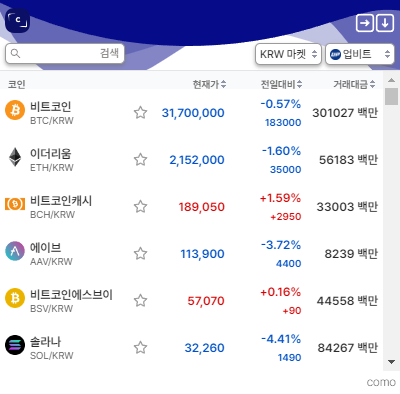
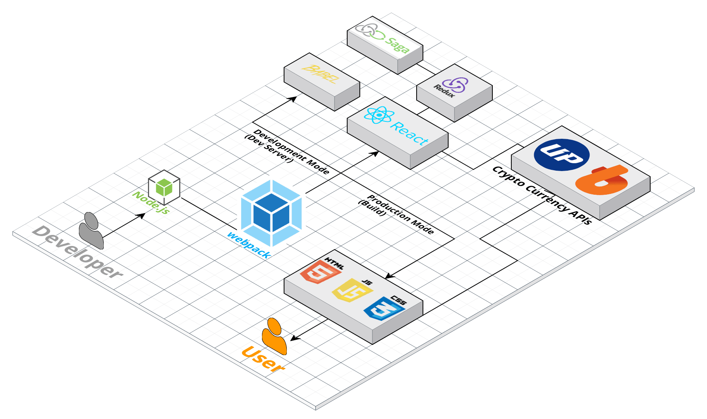

#  **COMO** **_- Cryptocurrency Monitoring Chrome Extension_**

<p align="center">
<br>
<br> 

<br>
<br>
가상화폐 시세조회 크롬 익스텐션
</p>

---

## Chrome Webstore
- "https://chrome.google.com/webstore/detail/%EC%BD%94%EB%AA%A8como-%EA%B0%80%EC%83%81%ED%99%94%ED%8F%90-%EA%B1%B0%EB%9E%98%EC%86%8C-%EC%8B%9C%EC%84%B8-%EB%AA%A8%EB%8B%88%ED%84%B0%EB%A7%81-%EB%B9%84/camiahnljjgndaficdcpboimdbdphnok"


## :wrench: Skills

<p align="center">
<br>
Dependencies
<br>
<br>  


  


<br>
<br>  
DevDependencies
<br>
<br>


</p>

---

## Preview

|||
|:---:|:---:|
|KRW / BTC 마켓 지원|업비트 / 빗썸 지원|
|||
|코인 즐겨찾기|창 확대 / 축소|
|||
|항목별 내림 / 오름차순 소팅|코인 한글 / 영문 검색|

---

## 프로젝트 구조

```jsx
COMO-Chrome-Extension
└─ src                      # webpack의 entry point 입니다.
  └─ pages                  # exentions 기능별 페이지 분류입니다
    └─ popup                # 해당 프로젝트 메인 팝업의 소스코드입니다
      ├─ Api                # Api를 모아놓은 폴더입니다
      ├─ Components         # 컴포넌트들을 모아놓습니다.
      ├─ Reducer            # Redux Reducer를 모아놓고 관리합니다.
      ├─ Utils              # Redux Action의 함수들을 모아놓고 관리합니다.
```

---

## Architecture

<p align="center">

</p >
